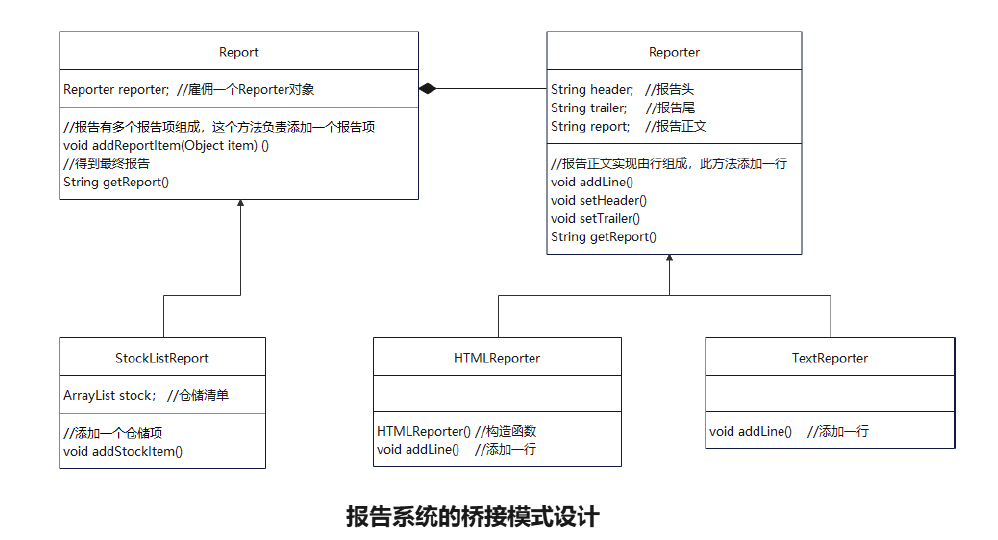

# 桥接（Bridge）模式

## 需求分析

- 我们要为某公司做一个管理软件，其中一个模块是“报告系统”，其功能是让公司各个部门汇总一段时间内的工作内容，并整理打印出工作报告。公司有仓储部门、HR部门等；仓储部门的工作内容记录的是一次次的货物进出；HR部门的工作内容记录的是一个个的员工进出。报告的打印格式可以有多种，比如HTML格式、普通文本格式等。


## 实验环境

- Java

## 代码说明

- 共5个类
  - 使用一个Report类来描叙一个报告的抽象，用一个Reporter类来描叙Report的实现格式，Report类引用着若干Reporter对象。在Report层次下面，有具体的一个StockListReport子类，用来表示货物清单报告。有一个具体类HRReport，用来表示公司员工的进出报告。Reporter的子类有HTMLReporter和TextReporter，用来分别实现HTML格式和Text格式的报告。
  
  

- 代码
```java
//报告类
import java.util.*;
public abstract class Report {
Reporter reporter; 
public Report(Reporter reporter) { this.reporter = reporter; }
public void addReportItem(Object item){
reporter.addLine(item.toString()); 
}
public String getReport(){ return reporter.getReport(); } 
}


//仓储报告类
import java.util.ArrayList;
import java.util.*;
public class StockListReport<StockItem> extends Report{
	ArrayList stock = new ArrayList();
	public StockListReport(Reporter reporter){
	super(reporter);
	}
	public void addStockItem(StockItem stockItem){
	stock.add(stockItem); 
	addReportItem(stockItem); 
	}
}


//报告格式类
public abstract class Reporter{
String header = "";
String trailer = "";
String report = "";
public abstract void addLine(String line);
public void setHeader(String header){
this.header = header;
}
public void setTrailer(String trailer){
this.trailer = trailer;
}
public String getReport(){ return header+report+trailer; }
}


//html格式的具体报告类
public class HTMLReporter extends Reporter{
public HTMLReporter(){
setHeader("<HTML>\n<HEAD></HEAD>\n<BODY>\n");
setTrailer("</BODY>\n</HTML>");
}
public void addLine(String line){
report += line + "<BR>\n";
}
}


//扩展的报告类
public class TextReporter extends Reporter{
public void addLine(String line) {
report += line + "\n";
}
}
```