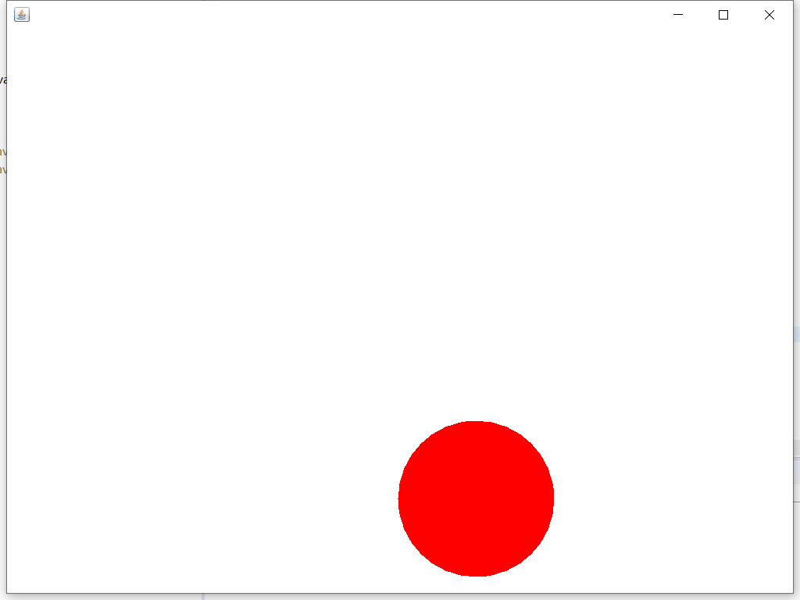

# MVC架构

## 抽象

- 模型-视图-控制器模式，也称为MVC模式（Model View Controller）
- MVC架构模式把软件划分为三个子系统：
    - 模型（Model）：负责存储系统的数据以及对数据的处理逻辑。
    - 视图（View）：将信息显示给用户（可以定义多个视图）。
    - 控制器（Controller）：控制器用于解释用户的鼠标和键盘输入，负责读取视图中的数据，并向模型请求服务和发送数据。

## 实例

- 代码分为三个class和一个Interface
  - MyController.java
    - 这是本工程的主类，同时也是一个窗口
    - 这个类还同时承担着MVC构架中控制器的角色，接收用户键盘输入,并实现Observer接口
  - MyModel.java
    - 这个类充当着MVC构架中的模型角色。这里只刻画了一个圆球
  - MyView.java
    - 这是一个Swing库中的内容面板JPanel，充当着MVC构架中的视图角色，负责渲染模型数据
  - Observer.java
    - 让视图和控制器都实现同一个接口Oberver，接口方法为update()
- 代码运行结果如下   

    

    > 当键盘敲击`A`,`W`,`S`,`D`时，控制器即会控制该圆球左、上、下、右移动，对应的，用户则可以通过试图看到球的移动