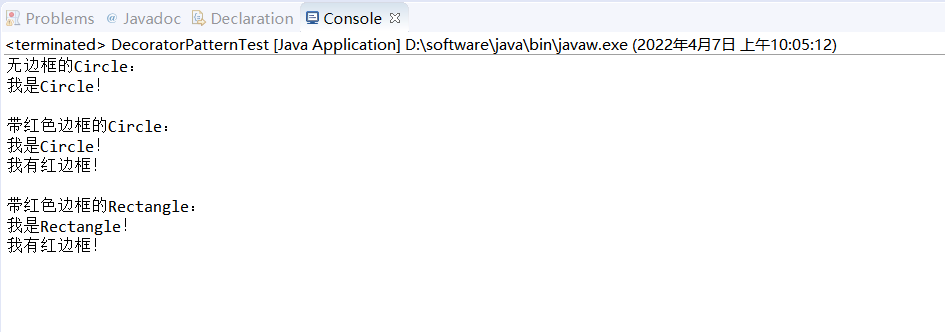

# 装饰(Decorator)模式

## 原理
- 一个图形用户界面工具箱中，我们希望可以对一个形状接口(比如IShape)添加一些特性，例如边框等。
在上面的分析中可以知道，使用继承机制对IShape添加特性不够灵活，比如我们不能控制添加边框的时
机。
- 另一种较为灵活的方法是：将一个形状对象（IShape）嵌入另一个对象中，由这个对象负责添加边框之
类的东西。我们称这个被嵌入的对象为装饰。它将客户的请求转发给该组件，并且可能在转发前后执行
一些额外操作(如画一个边框、滚动条等)。
- 假设有一个IShape对象，缺省的它没有边框，因为我们可能有时并不需要边框。当真正需要边框时，我
们可以用ShapeDecorator添加边框。因此只要简单地将这些装饰和IShape组合起来，就可以达到预期
的效果。
- 这个模式最关键的一点是：让这个装饰对象与它装饰的组件的接口要保持一致，使得它对于使用该组件
的客户透明，即客户不会感觉到装饰过的组件与未装饰组件之间的差异。

## 适用性
- 在不影响其它对象的情况下，以动态、透明的方式给单个对象添加、删除职责。
- 当不能采用生成子类的方式进行功能扩展时。

## 实验运行结果

- 代码运行结果如下：
  
  