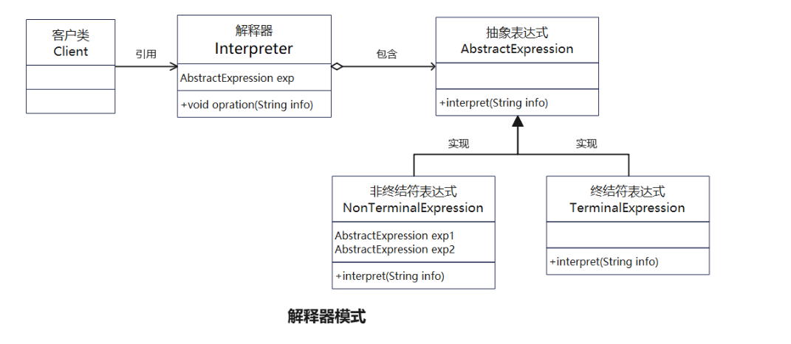
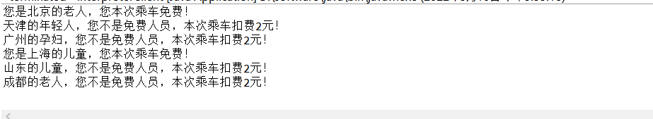

# 解释器模式

## 抽象

- 解释器模式往往被归类为“设计模式”，描述一个软件子系统的局部设计方案。但也有很多人把它归为“体系结构模式”，用于描述整个软件系统的结构设计。本课程也将它归为体系结构模式里
- 如果一种特定类型的问题发生的频率足够高，那么可能就值得将该问题的各个实例表述为一个简单语言中的句子。这样就可以构建一个解释器，该解释器通过解释这些句子来解决该问题
- 解决方式的核心是：构建语法树，定义终结符与非终结符
- 结构如下  

    

    > 1. 抽象表达式（Abstract Expression）角色：定义解释器的接口，约定解释器的解释操作，主要包含解释方法 interpret()。
    > 2. 终结符表达式（Terminal Expression）角色：是抽象表达式的子类，用来实现文法中与终结符相关的操作，遇到这个表达式interpreter执行能直接返回结果，不会向下继续调用。
    > 3. 非终结符表达式（Nonterminal Expression）角色：也是抽象表达式的子类。文法中每一个规则都需要一个具体的非终结符表达式，一般用于表示文法中的运算符或关键字。
    > 4. 解释器（Interpreter）角色：通常包含解释器需要的数据或是公共的功能，一般用来传递被所有解释器共享的数据，后面的解释器可以从这里获取这些值。
    > 5. 客户端（Client）：使用解释器的类，主要工作是创建解释器，并调用解释器的解释方法

## 实例

- 代码功能：以公交卡读卡器为例，规定北京、上海、广州和深圳的老人、儿童和孕妇免费，其余人标准价，组成如下
  - InterpreterClient.java:客户端，创建一个解释器
  - AbstractExpression:定义解释器的接口
  - TerminalExpression:保存了所以的终结符
  - AndExpression：解释器接口AbstractExpression的实现
  - Interpreter:解释器角色，包含需要的功能

- 运行结果如下  

    
    